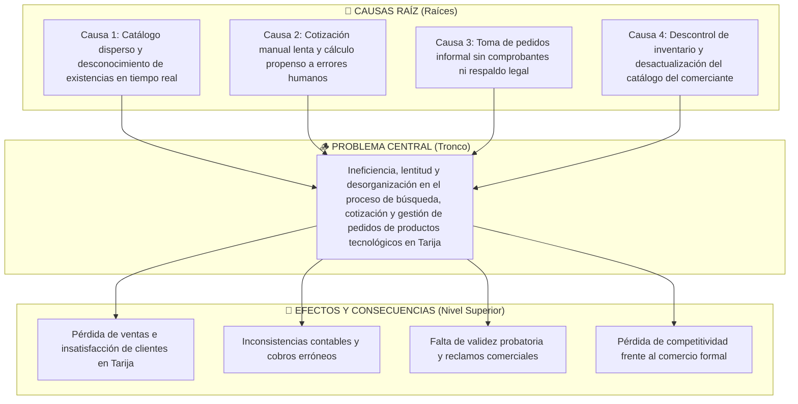
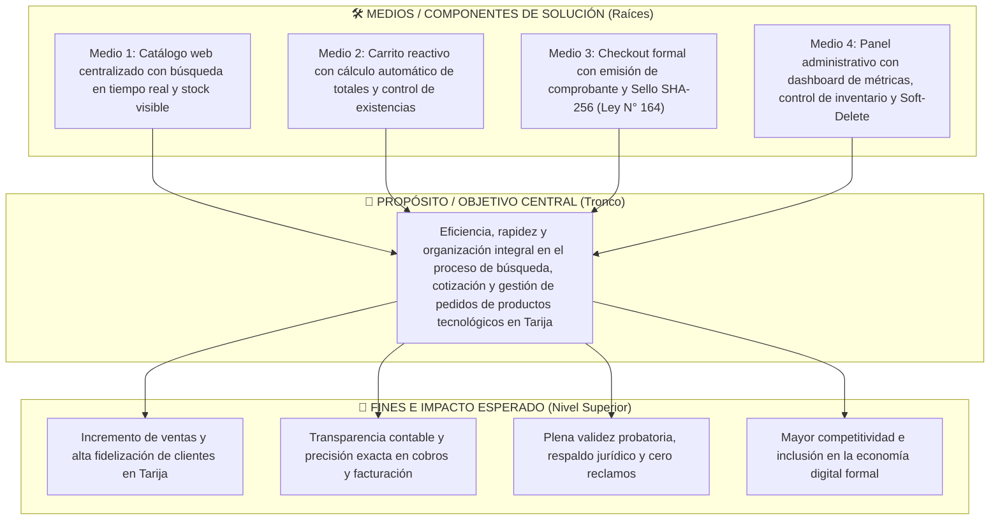

# Product Requirements Document (PRD) 
**Proyecto:** TechStore MVP  
**Rol:** Senior Product Manager  
**Fecha:** Agosto 2026  
**Ubicación:** Tarija, Bolivia  

---

## 1. Visión y Objetivos

**Contexto del Problema:**
Actualmente, la búsqueda de productos y la gestión de pedidos de artículos tecnológicos (teclados, mouse, audífonos, etc.) en Tarija se realizan de manera manual y desorganizada. Esto genera dificultades para que los clientes encuentren productos, conozcan su disponibilidad en tiempo real y organicen sus compras con validez jurídica.

### 1.1. Árbol de Problemas (Nodo Problematizador)

### 1.2. Árbol de Soluciones / Objetivos

### 1.3. Trazabilidad: Causas del Árbol ➔ Historias de Usuario (MVP)

| Causa Raíz del Problema | Medio de Solución | Historia de Usuario (MVP) | Solución Técnica en el Sistema |
| :--- | :--- | :--- | :--- |
| **Causa 1:** Catálogo disperso y stock desconocido. | **Medio 1:** Catálogo centralizado y transparente. | **HU-01: Consultar productos** | Catálogo interactivo con buscador por texto, filtro por categoría y badges de stock (`Activo` vs `Agotado`). |
| **Causa 2:** Cotización manual y errores en cálculos. | **Medio 2:** Carrito automatizado y reactivo. | **HU-02: Agregar productos al carrito** | Carrito reactivo con cálculo automático de subtotales/totales y restricción contra el stock en BD. |
| **Causa 3:** Pedidos informales sin respaldo legal. | **Medio 3:** Checkout con validez probatoria. | **HU-03: Realizar pedido** | Formulario de entrega, validación concurrente, código único `PED-XXXXXX` y Sello Criptográfico SHA-256 (Ley N° 164). |
| **Causa 4:** Descontrol de inventario y desactualización. | **Medio 4:** Gestión administrativa integral. | **HU-04: Gestionar productos** | Panel administrativo con dashboard de métricas, ajuste rápido de stock y Soft-Delete para no corromper historiales. |

### 1.4. Alineación con los Objetivos de Desarrollo Sostenible (ODS - CEPAL)
* **ODS 8 (Trabajo Decente y Crecimiento Económico - Metas 8.2 y 8.3):** Impulsa la formalización y modernización de micro y pequeñas empresas comerciales en Tarija mediante la digitalización de sus canales de venta.
* **ODS 9 (Industria, Innovación e Infraestructura - Meta 9.c):** Fomenta la adopción de tecnologías de información y comercio electrónico seguro (TICs) con estándares abiertos y protocolos criptográficos.

**Visión del Producto:**
Desarrollar "TechStore", una plataforma web sencilla e intuitiva que centralice el catálogo de productos, permita agregarlos a un carrito y facilite la realización de pedidos online con plena validez probatoria.

**Objetivo Central (SMART):**
Desarrollar e implementar en un periodo de **2 semanas** una tienda virtual MVP (Mínimo Producto Viable) que permita a los clientes consultar productos, gestionar un carrito y realizar pedidos; y al administrador gestionar el catálogo, cumpliendo con 4 Historias de Usuario principales bajo estándares de seguridad e integridad de datos.

**Beneficiarios:**
*   **Beneficiario Real (Principal):** Cliente de la tienda.
*   **Beneficiario Secundario:** Administrador o encargado de la tienda.

---

## 2. Alcance (Scope)

**Incluido en el MVP:**
*   Consulta de productos y búsqueda básica por nombre/categoría.
*   Visualización de precio, imagen y disponibilidad de stock.
*   Carrito de compras (agregar, modificar cantidades, calcular totales).
*   Registro de pedidos con datos básicos de entrega.
*   Gestión de productos (CRUD y cambio de estados) por parte del administrador.
*   Validaciones básicas de datos, stock y cálculos.

**Fuera del Alcance (Out of Scope):**
*   Integración con bancos o pasarelas de pago reales.
*   Sistema de envíos y seguimiento mediante empresas de transporte.
*   Aplicación móvil nativa.
*   Sistema avanzado de recomendaciones o chat en tiempo real.
*   Gestión contable o financiera de la tienda.

---

## 3. Stack Tecnológico (Propuesto para el MVP)

Basado en los diagramas UML, diagramas de clases y la naturaleza relacional de la arquitectura descrita, se define el siguiente stack para soportar el patrón **MVC (Modelo-Vista-Controlador)**:

*   **Frontend (Vista):** React.js o Vue.js (Ideal para SPAs interactivas y gestión de estados de carritos en tiempo real).
*   **Backend (Controlador / Servicio / Repositorio):** Node.js con Express o Java Spring Boot. Ambos soportan eficientemente la arquitectura en capas especificada.
*   **Base de Datos (Modelo):** PostgreSQL o MySQL. Requerido debido a la naturaleza estricta del modelo físico (Claves Foráneas, campos SERIAL/INT, integridad referencial).
*   **Documentación de Arquitectura:** PlantUML (Implementado para diagramas de Casos de Uso, Secuencia, Estados y Clases).

---

## 4. Modelo de Datos Exacto (Diccionario de Datos)

El modelo físico relacional se implementará con **8 tablas principales**. 

### 4.1. USUARIO
| Atributo | Tipo de Dato | Nulo | PK/FK | Restricciones / Descripción |
| :--- | :--- | :--- | :--- | :--- |
| `id_usuario` | SERIAL / INT | NO | PK | Identificador único y autogenerado del usuario. |
| `nombre` | VARCHAR(100) | NO | - | Nombre completo del usuario. |
| `email` | VARCHAR(150) | NO | - | Correo electrónico del usuario. Debe ser único. |
| `telefono` | VARCHAR(20) | SI | - | Número telefónico del usuario. |
| `rol` | VARCHAR(20) | NO | - | Define el tipo de usuario: CLIENTE o ADMINISTRADOR. |
| `fecha_registro`| DATE | NO | - | Fecha de registro. Por defecto utiliza la fecha actual. |

### 4.2. CATEGORIA
| Atributo | Tipo de Dato | Nulo | PK/FK | Restricciones / Descripción |
| :--- | :--- | :--- | :--- | :--- |
| `id_categoria` | SERIAL / INT | NO | PK | Identificador único y autogenerado. |
| `nombre` | VARCHAR(50) | NO | - | Nombre de la categoría. Debe ser único. |
| `descripcion` | VARCHAR(255) | SI | - | Descripción de la categoría de productos. |
| `estado` | VARCHAR(15) | NO | - | Activa o Inactiva. |

### 4.3. PRODUCTO
| Atributo | Tipo de Dato | Nulo | PK/FK | Restricciones / Descripción |
| :--- | :--- | :--- | :--- | :--- |
| `id_producto` | SERIAL / INT | NO | PK | Identificador único y autogenerado. |
| `nombre` | VARCHAR(100) | NO | - | Nombre comercial del producto tecnológico. |
| `descripcion` | TEXT | SI | - | Descripción detallada del producto. |
| `precio` | DECIMAL(10,2)| NO | - | Precio del producto. Debe ser mayor a 0. |
| `stock` | INT | NO | - | Cantidad disponible. Debe ser mayor o igual a 0. |
| `imagen` | VARCHAR(255) | SI | - | Ruta o URL de la imagen del producto. |
| `estado` | VARCHAR(15) | NO | - | Activo, Agotado o Inactivo. |
| `fecha_creacion`| DATE | NO | - | Fecha de creación del registro. |
| `fecha_actualizacion`| DATE | SI | - | Fecha de la última modificación. |
| `id_categoria` | INT | NO | FK | Referencia a `CATEGORIA.id_categoria`. |

### 4.4. CARRITO
| Atributo | Tipo de Dato | Nulo | PK/FK | Restricciones / Descripción |
| :--- | :--- | :--- | :--- | :--- |
| `id_carrito` | SERIAL / INT | NO | PK | Identificador único y autogenerado. |
| `id_usuario` | INT | NO | FK | Propietario del carrito. Ref a `USUARIO.id_usuario`. |
| `fecha_creacion`| DATE | NO | - | Fecha de creación del carrito. |
| `estado` | VARCHAR(20) | NO | - | Vacio, Con Productos o Confirmado. |

### 4.5. ITEM_CARRITO
| Atributo | Tipo de Dato | Nulo | PK/FK | Restricciones / Descripción |
| :--- | :--- | :--- | :--- | :--- |
| `id_item` | SERIAL / INT | NO | PK | Identificador único del elemento. |
| `id_carrito` | INT | NO | FK | Referencia a `CARRITO.id_carrito`. |
| `id_producto` | INT | NO | FK | Referencia a `PRODUCTO.id_producto`. |
| `cantidad` | INT | NO | - | Unidades seleccionadas. Mayor a 0. |
| `precio_unitario`| DECIMAL(10,2)| NO | - | Precio al momento de agregarlo. |
| `subtotal` | DECIMAL(10,2)| NO | - | `cantidad` * `precio_unitario`. |

### 4.6. DIRECCION_ENTREGA
| Atributo | Tipo de Dato | Nulo | PK/FK | Restricciones / Descripción |
| :--- | :--- | :--- | :--- | :--- |
| `id_direccion` | SERIAL / INT | NO | PK | Identificador único y autogenerado. |
| `id_usuario` | INT | NO | FK | Propietario de la dir. Ref a `USUARIO.id_usuario`. |
| `nombre_receptor`| VARCHAR(100) | NO | - | Persona que recibirá el pedido. |
| `direccion` | VARCHAR(255) | NO | - | Dirección física de entrega. |
| `ciudad` | VARCHAR(100) | NO | - | Ciudad donde se realizará la entrega. |
| `telefono` | VARCHAR(20) | NO | - | Número de contacto para la entrega. |

### 4.7. PEDIDO
| Atributo | Tipo de Dato | Nulo | PK/FK | Restricciones / Descripción |
| :--- | :--- | :--- | :--- | :--- |
| `id_pedido` | SERIAL / INT | NO | PK | Identificador único y autogenerado. |
| `numero_pedido` | VARCHAR(20) | NO | - | ID único (público) para identificar el pedido. |
| `id_usuario` | INT | NO | FK | Referencia a `USUARIO.id_usuario`. |
| `id_direccion` | INT | NO | FK | Dirección utilizada (Ref `DIRECCION_ENTREGA`). |
| `fecha` | DATE | NO | - | Fecha de creación del pedido. |
| `estado` | VARCHAR(20) | NO | - | Pendiente, Confirmado, Preparando, Entregado, Rechazado. |
| `total` | DECIMAL(10,2)| NO | - | Importe total. Mayor o igual a 0. |

### 4.8. DETALLE_PEDIDO
| Atributo | Tipo de Dato | Nulo | PK/FK | Restricciones / Descripción |
| :--- | :--- | :--- | :--- | :--- |
| `id_detalle` | SERIAL / INT | NO | PK | Identificador único y autogenerado. |
| `id_pedido` | INT | NO | FK | Referencia a `PEDIDO.id_pedido`. |
| `id_producto` | INT | NO | FK | Producto incluido en el pedido. |
| `cantidad` | INT | NO | - | Unidades solicitadas. Mayor a 0. |
| `precio_unitario`| DECIMAL(10,2)| NO | - | Precio del producto al realizar el pedido. |
| `subtotal` | DECIMAL(10,2)| NO | - | `cantidad` * `precio_unitario`. |

---

## 5. Reglas de Negocio y Cumplimiento Legal

Para operar adecuadamente dentro de Tarija y el territorio boliviano, el sistema incorporará reglas de negocio intrínsecas a su diagrama de estados, en conjunción con el marco legal aplicable al comercio electrónico en el país:

### Reglas de Sistema
1. **Gestión de Stock:**
   * `Stock > 0`: Estado "Activo / Disponible".
   * `Stock = 0`: Estado "Agotado". Se muestra en catálogo pero se desactiva el botón de agregar al carrito.
   * `Inactivo`: No aparece en el catálogo. Mecanismo de *Soft-Delete* para preservar historiales.
2. **Validación Concurrente:** El carrito debe validar la disponibilidad del stock nuevamente en el momento exacto del *Checkout* (Validando información -> Confirmado).
3. **Restricción Comercial:** Los precios deben ser positivos (mayores a cero) y las cantidades ingresadas por el cliente no pueden exceder el stock disponible.

### Cumplimiento Legal (Leyes Bolivianas)
*   **Ley N° 164 (Ley General de Telecomunicaciones, Tecnologías de Información y Comunicación):** Esta normativa otorga validez probatoria y jurídica a los negocios (como el checkout de un carrito de compras) realizados mediante documentos y comunicaciones digitales,. Las confirmaciones de los pedidos generadas por el sistema fungirán como contratos de compraventa electrónicos lícitos.
*   **Ley N° 453 (Ley General de los Derechos de las Usuarias y los Usuarios y de las Consumidoras y los Consumidores):** En obediencia al derecho a la información veraz y la prevención de publicidad engañosa,, el catálogo debe especificar explícitamente los precios finales desglosados (incluyendo IVA si es que aplica legalmente en un MVP). Asimismo, las validaciones de "Producto Agotado" existen para garantizar que no se oferten condiciones o productos que la tienda no puede cumplir, evitando cláusulas o retenciones económicas indebidas.

---

## 6. Backlog de Historias de Usuario (MVP)

A continuación, las 4 Historias de Usuario fundamentales destiladas de las sesiones de refinamiento, listas para ser asignadas en el tablero Kanban del equipo:

### HU-01: Consultar productos
**Como** cliente de TechStore  
**Quiero** consultar y buscar productos por nombre o categoría, visualizando su información, precio y disponibilidad  
**Para** encontrar fácilmente los artículos que deseo comprar.  

* **Criterios de Aceptación:**
  * El catálogo debe mostrar nombre, imagen, precio y disponibilidad de forma organizada.
  * Debe existir un filtro por categorías y una barra de búsqueda por nombre.
  * Los productos con estado `Stock = 0` deben mostrar una etiqueta visible de "Agotado".
  * Si la búsqueda no arroja resultados, el sistema debe desplegar un mensaje amigable: *"No se encontraron productos"*.

### HU-02: Agregar productos al carrito
**Como** cliente de TechStore  
**Quiero** agregar productos disponibles al carrito, indicando y modificando las cantidades  
**Para** preparar mi compra y conocer el subtotal/total antes de realizar el pedido.  

* **Criterios de Aceptación:**
  * El usuario puede modificar la cantidad de unidades dentro del carrito.
  * El sistema debe validar que la cantidad ingresada no supere el `stock` en la base de datos (mostrar error *"Cantidad no disponible"*).
  * No se pueden agregar productos "Agotados".
  * El carrito actualiza automáticamente el `subtotal` por ítem y el `total` general.
  * Al agregar un producto con éxito, se muestra un mensaje de confirmación en la UI.

### HU-03: Realizar pedido
**Como** cliente de TechStore  
**Quiero** confirmar los productos de mi carrito e ingresar mis datos de entrega  
**Para** generar un pedido y recibir una confirmación con un número de identificación único.  

* **Criterios de Aceptación:**
  * El usuario no puede hacer checkout de un "Carrito vacío".
  * Debe existir un formulario obligatorio para los datos de entrega (Nombre, Teléfono, Dirección, Ciudad).
  * Justo antes de crear el registro, el sistema valida el stock final. Si algún producto se agotó en el interín, se rechaza y notifica al cliente *"Producto sin stock"*.
  * Si es exitoso, se genera un número de pedido autogenerado, se descuenta el stock correspondiente y el carrito pasa a estado "Confirmado" (listo para pedido).

### HU-04: Gestionar productos
**Como** administrador de la tienda  
**Quiero** crear, modificar y desactivar productos, gestionando su información, precio y stock  
**Para** mantener actualizado el catálogo sin perder el historial operativo.  

* **Criterios de Aceptación:**
  * Solo los usuarios con rol `ADMINISTRADOR` pueden acceder al panel.
  * Todos los campos de registro (nombre, descripción, precio, categoría, stock) son obligatorios.
  * El precio debe ser `> 0` y el stock `>= 0`. No se permiten valores negativos.
  * Si un administrador desea dar de baja un producto, se usa la opción "Desactivar" (cambio de estado a `Inactivo`), no se elimina (DELETE) de la base de datos para no romper dependencias históricas con facturas o pedidos.
  * Se pueden modificar las propiedades e incrementar el stock en cualquier momento.

---

## 7. Marco Legal y Ética de Datos

El diseño, arquitectura y operación de la plataforma TechStore en el Estado Plurinacional de Bolivia se fundamenta en el cumplimiento estricto del marco normativo nacional en materia de comercio electrónico, protección de datos personales, ciberseguridad y derechos del consumidor.

### 7.1. Garantía del Derecho de Habeas Data y Derechos ARCO
Conforme a los **Artículos 130 y 131 de la Constitución Política del Estado (CPE)** y los principios de autodeterminación informativa:

1. **Derecho de Acceso y Portabilidad:** Todo usuario registrado puede visualizar en cualquier momento su perfil completo, direcciones de entrega guardadas y el historial íntegro de sus pedidos a través de su panel personal, con capacidad prevista de exportar sus datos en formatos interoperables y abiertos (`JSON` / `CSV`).
2. **Derecho de Rectificación y Actualización:** El sistema permite al titular corregir o actualizar sus datos de contacto (teléfono, nombre, direcciones físicas) garantizando la exactitud de la información almacenada.
3. **Derecho de Cancelación / Supresión ("Derecho al Olvido"):** El usuario puede solicitar la baja de su cuenta. Para conciliar la supresión de datos con las obligaciones legales de retención comercial y tributaria (**Código Tributario Boliviano - Ley N° 2492**, plazo de prescripción de 8 años):
   - Se aplican mecanismos de **Anonimización / Pseudonimización** en los registros de pedidos históricos (`id_usuario` desvinculado de datos nominativos).
   - Se ejecuta el borrado definitivo de carritos activos, tokens de sesión y direcciones temporales no vinculadas a transacciones perfeccionadas.
4. **Derecho de Oposición y Consentimiento Informado:** Se recaba el consentimiento explícito del usuario previo a la recolección de datos, prohibiendo la cesión o comercialización de información personal a terceros sin autorización previa.

### 7.2. Cumplimiento de la Ley N° 164 (Telecomunicaciones y TIC) y Decretos Reglamentarios
En el marco de la **Ley General N° 164**, el **D.S. 1793** y el **D.S. 3525**:

1. **Validez Jurídica y Probatoria de Contratos Digitales (Art. 79):**
   - El proceso de checkout y la confirmación del pedido (`PED-XXXXXX`) constituyen contratos de compraventa electrónicos válidos y vinculantes.
   - Cada transacción genera un comprobante electrónico con sello de tiempo (*timestamping*) y resumen criptográfico (Hash SHA-256) que garantiza la integridad inalterable del documento digital.
2. **Adopción de Estándares Abiertos y Software Libre (Art. 77):**
   - El sistema prioriza el uso de formatos abiertos y estándares web universales (JSON, REST, HTTP/2, UTF-8, SVG, SQL ANSI) para evitar el secuestro tecnológico (*vendor lock-in*) y garantizar la interoperabilidad con servicios del Estado (ej. pasarelas de pago del Banco Central de Bolivia y facturación electrónica del SIN).
3. **Firmas Digitales y No Repudio:**
   - La arquitectura prevé la integración con Entidades Certificadoras Autorizadas en Bolivia (**ADSIB** - Agencia para el Desarrollo de la Sociedad de la Información en Bolivia) para la emisión y validación de certificados y firmas digitales en facturas y órdenes de compra de alto valor.

### 7.3. Seguridad de la Información, Protocolos Criptográficos y Trazas de Auditoría (Directrices ASFI / ISO 27001)
Tomando como referencia las mejores prácticas de la **Autoridad de Supervisión del Sistema Financiero (ASFI - Circular 508/2017 y R.N. 136/2018)** y estándares internacionales (**ISO/IEC 27001 / OWASP Top 10**):

1. **Cifrado en Tránsito (Data in Transit):**
   - Todas las comunicaciones cliente-servidor se canalizan exclusivamente mediante el protocolo **TLS 1.3 / HTTPS** con suite de cifrado robusto (AES-GCM / ChaCha20-Poly1305) y directivas HSTS (*HTTP Strict Transport Security*) para mitigar ataques *Man-In-The-Middle* (MitM).
2. **Cifrado y Protección en Reposo (Data at Rest):**
   - Almacenamiento seguro de credenciales mediante algoritmos de derivación de claves con factor de coste adaptativo (**Argon2id** o **bcrypt** con salting dinámico).
   - Cifrado a nivel de base de datos (`pgcrypto` / AES-256) para campos sensibles de contacto (teléfonos, direcciones físicas exactas y números de identificación personal).
3. **Logs de Auditoría y Trazabilidad Inmutable:**
   - Registro automatizado de eventos de seguridad en una tabla dedicada de auditoría (`audit_log`): identificación del actor (`id_usuario`), dirección IP de origen, User-Agent, fecha/hora precisa en UTC, tipo de evento (`AUTH_LOGIN`, `ORDER_CREATED`, `STOCK_UPDATED`, `PRODUCT_DEACTIVATED`, `UNAUTHORIZED_ACCESS_ATTEMPT`) y estado de la operación.
   - Protección contra manipulación de logs (*tamper-proof logging*) para servir como evidencia forense válida en procesos legales y peritajes informáticos.
4. **Control de Acceso y Principio de Menor Privilegio (RBAC):**
   - Segregación estricta de funciones entre `CLIENTE` y `ADMINISTRADOR` mediante tokens de acceso firmados criptográficamente (JWT con expiración corta y rotación de Refresh Tokens), previniendo vulnerabilidades de escalamiento de privilegios y accesos indebidos (**Art. 363 ter Código Penal Boliviano**).
